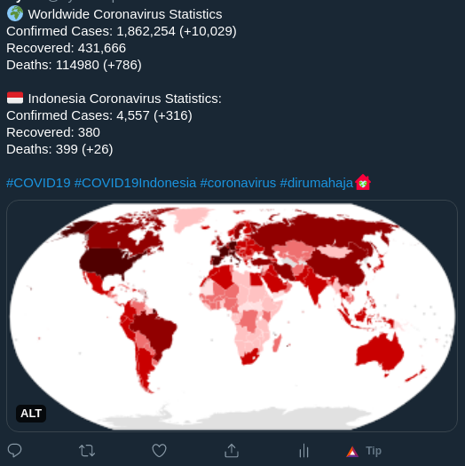

# Covid19 Twitter Bot
Tweets the latest statistics for COVID19

<div align="center">
  <br>
</div>

### Prerequisites
* NodeJS
* NPM
* Git

### Installation
Open terminal and run the following commands:

```sh
git clone https://github.com/nikotidar/covid19-twitter
cd covid19-twitter
```

### Getting Started
* Create a twitter bot at [https://developer.twitter.com/en/apps](https://developer.twitter.com/en/apps).
* Rename `config.example.js` to `config.js`, then copy and paste all tokens and secrets into the file.
* Run `node index.js` to start the bot.
